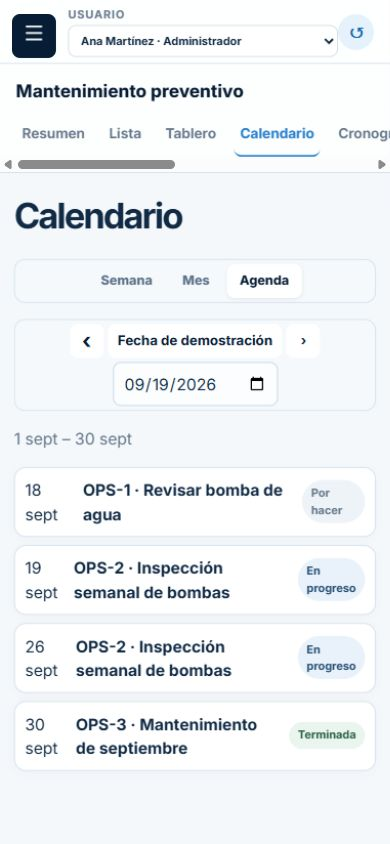
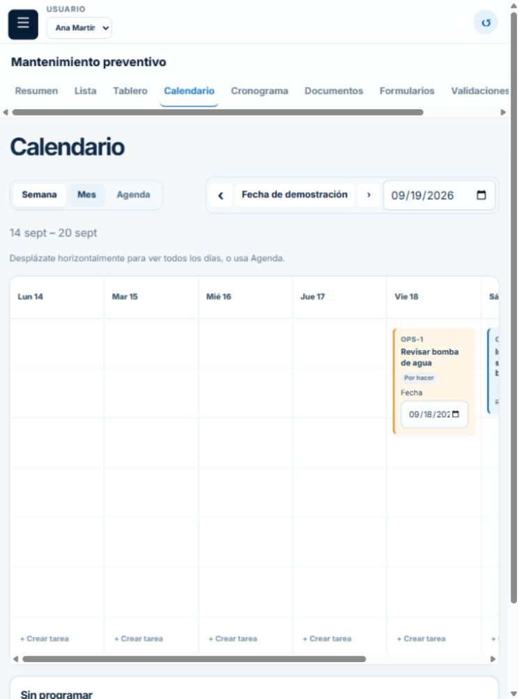
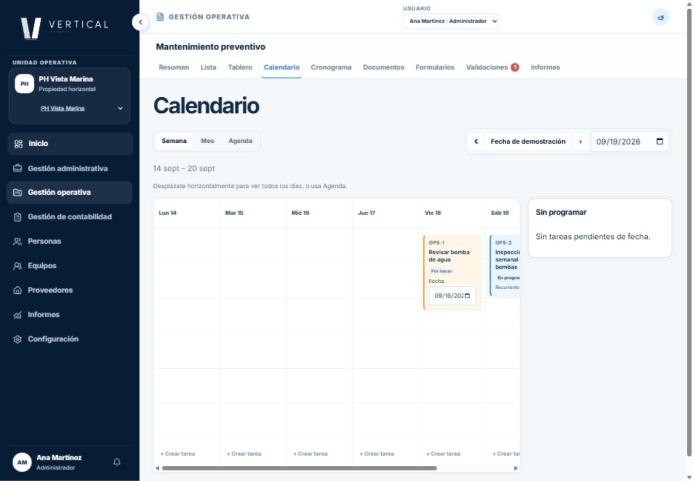

# Issue #61 — correcciones UX/UI y evidencia

Fecha: 2026-10-06. Base: `38e4ef7`. Relacionado con el épico #55.

## Correcciones

- El editor del tablero mantiene un borrador por tarea, confirma el descarte y no reutiliza campos de otra tarea.
- Tablero y vistas se aíslan por PH, proyecto y actor; se descartan cargas anteriores. Cambiar PH elimina identificadores de la URL y vuelve a la selección de proyectos.
- Los estilos del sidebar y encabezado global se limitan a sus componentes. «Sin programar» permanece en el flujo de página, sin tapar el calendario móvil.
- Los errores conservan la vista y el motivo de rechazo. Reintentar recupera la carga. Un guardado confirmado seguido de un fallo de lectura se distingue de una escritura fallida.
- Tipos de tarea traducidos y opciones de filtro visibles; filtros nativos con semántica de formulario y teclado.
- Enlaces del menú contraído con nombre accesible y tooltip; notificaciones tiene un enlace real.
- Diálogo nativo compartido con fondo inerte, ciclo de Tab/Shift+Tab, Escape y restauración de foco. En límites de columna el foco vuelve al botón de opciones, porque el elemento del menú se desmonta.
- Calendario usa el mismo conjunto de ocurrencias en semana, mes y agenda, sin duplicar la inicial; navega meses completos. Las instancias recurrentes no simulan una edición individual que el dominio no ofrece.
- Comentarios, adjuntos y formulario capturan el elemento antes de la espera asíncrona.
- Calendario desplazable por teclado, encabezados compactos, botones destructivos diferenciados y textos orientados al usuario. La fecha fija del conjunto de datos se identifica como «Fecha de demostración».
- `AppShell` contiene un límite Suspense para sus lecturas de URL: el build de producción detectó esta necesidad, que no aparecía en desarrollo.

## Verificación automatizada

Se ejecutaron los comandos oficiales en Windows con Node 24.16.0 y pnpm 11.19.0:

| Comando | Resultado |
| --- | --- |
| `pnpm lint` | Aprobado, seis paquetes |
| `pnpm typecheck` | Aprobado, seis paquetes |
| `pnpm test` | 68 pruebas aprobadas: 35 web, 20 datos, 11 dominio, 2 shared |
| `pnpm build` | Aprobado, compilación y generación de páginas |

Se añadieron 27 regresiones. Incluyen borrador/cancelación/guardado aislado, PH/proyecto/actor, respuestas tardías, reintento, rechazo de transición, conflicto, guardado con recarga fallida, recurrencias, formularios y foco. UI y config actualmente no tienen tests propios. Turbo emite avisos de outputs no configurados para tareas sin artefactos; no son fallos de pruebas.

JSDOM necesita simular `showModal`/`close`; esa simulación no demuestra modalidad nativa. Se complementó con navegador real para foco y contexto accesible.

## Recorrido manual

Demo local en `127.0.0.1:3100`, sin servicios de producción.

1. Tablero: abrir OPS-1, escribir un borrador, cambiar a OPS-2; título y prioridad pertenecen a OPS-2. La confirmación nativa no pudo capturarse de forma fiable con la automatización del navegador; cancelar/confirmar y el guardado aislado están cubiertos por pruebas de componente.
2. Cambiar Vista Marina → Bahía Azul: desaparecen las tareas y el editor anteriores; la URL vuelve a `/operaciones`. Restaurar Vista Marina.
3. Contraer menú: los enlaces conservan Inicio, Personas, Informes, etc. en el árbol accesible.
4. Lista: intentar completar OPS-1 sin aprobación. Se conserva la tabla, aparece la explicación de dominio y «Volver a cargar» limpia el error.
5. Editor de lista: foco inicial en nombre, Tab desde Guardar vuelve a Cerrar, Escape cierra y devuelve foco a Editar.
6. Límite de columna: Escape devuelve foco a «Opciones de Por hacer».
7. Calendario: mes/agenda muestran OPS-2 el 19 y 26 de septiembre sin repetir el día 19. Semana muestra la ocurrencia del período.
8. Calendario a 390 × 844, 760 × 1024 y 1440 × 1000: panel sin programar con `position: static`; sin desbordamiento horizontal de la página. Mes/semana usan desplazamiento interno para conservar legibilidad; Agenda ofrece una alternativa vertical móvil.

### Capturas

## Límites

No es una certificación WCAG ni una auditoría de todos los módulos. No se probaron lectores de pantalla físicos, todos los navegadores, zoom al 200 % ni todas las combinaciones de permisos. No se modificaron reglas de autorización, persistencia o expansión de recurrencias del dominio. No se implementó el backend del issue #58 ni se cerró el rediseño completo #55. El PR requiere revisión y no se fusiona automáticamente.
